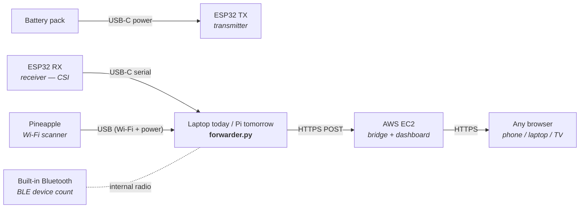

# 5map Knowledge Base

Research papers, references, and domain knowledge relevant to the 5map project.

---

## Demo Architecture

Target architecture for the initial demo. The laptop is the temporary host —
post-demo, its role moves to a Raspberry Pi (same forwarder script, same
sensors, same cloud endpoint).

### Physical room setup

Place the two ESP32s on opposite sides of the zone you want to monitor; people
moving between them disrupt the radio path and produce the CSI signal.

```mermaid
flowchart LR
    subgraph zone["Demo zone (balcony / room) — 3 to 5 m apart"]
        direction LR
        TX["ESP32 TX<br/><i>battery pack</i>"]
        Person(("Person<br/><i>disrupts signal</i>"))
        RX["ESP32 RX<br/><i>USB-C to laptop</i>"]
        PA["Wi-Fi Pineapple<br/><i>USB to laptop</i>"]
        TX -. "CSI radio waves" .- Person
        Person -. .- RX
        PA -.- TX
        PA -.- RX
    end
```

### Wiring + data flow

Three sensors plug into one host (laptop today, Pi tomorrow). The host runs
`forwarder.py`, which aggregates everything and POSTs to AWS EC2 over HTTPS.
EC2 hosts both the ingest bridge and the dashboard, so any browser on any
device can view live results.



### Notes on the four sensor sources

| Source | Role | Firmware / runtime | Replaceable by Pi? |
|---|---|---|---|
| **ESP32 TX** | Continuous Wi-Fi beacon — provides the signal whose perturbations RX measures | MicroPython is fine (no CSI read needed) | No — physical radio source |
| **ESP32 RX** | Captures Wi-Fi CSI from TX, streams over USB serial | Must be **native C / ESP-IDF** — MicroPython doesn't expose `esp_wifi_set_csi_rx_cb` | No — physical radio receiver |
| **Wi-Fi Pineapple** | Scans Wi-Fi APs / clients in range, provides RSSI map | Pineapple firmware (HAK5) | No — physical hardware |
| **Built-in Bluetooth** | Counts unique BLE devices visible to the host | Host OS Bluetooth stack (`bleak` etc. in Python) | Yes — Pi 4/5 has BLE built in |

### Laptop → Pi migration

Once the demo is proven, the host moves from a laptop to a Raspberry Pi. Same
USB ports, same `forwarder.py`, same EC2 endpoint. The Pi gains a small case,
optionally PoE-powered, and lives in the demo zone full-time.

Things that need to port cleanly when the host changes:
- USB serial enumeration (Pi assigns `/dev/ttyUSB*`, Mac assigns `/dev/cu.usbserial-*`) — `forwarder.py` should accept a port glob, not a hard path.
- `bleak` works identically on macOS and Linux for BLE scanning — no code change needed.
- Pineapple driver model differs (hostapd vs Pineapple OS over USB-Ethernet) — verify before the swap.

---

## WiPi: A Low-Cost Large-Scale Remotely-Accessible Network Testbed

**Authors:** Abdelhamid Attaby, Nada Osman, Mustafa ElNainay, Moustafa Youssef
**Published:** IEEE Access, Volume 7, November 19, 2019
**DOI:** 10.1109/ACCESS.2019.2953356

### Sources
- [IEEE Xplore](https://ieeexplore.ieee.org/abstract/document/8905988)
- [ResearchGate](https://www.researchgate.net/publication/337376522_Wipi_A_Low-Cost_Large-Scale_Remotely-Accessible_Network_Testbed)
- [Academia.edu](https://www.academia.edu/91979738/Wipi_A_Low_Cost_Large_Scale_Remotely_Accessible_Network_Testbed)

### Abstract
WiPi addresses the high cost of establishing network experimental labs by providing a remotely accessible testbed using low-cost devices (Raspberry Pi, commodity laptops). It supports large-scale networking experiments by combining simulation, emulation, and real device experimentation. The hybrid approach reduces total execution time by ~40% compared to single-node simulations.

### Architecture
- **Hardware:** Raspberry Pi 3 Model B ($25-35/unit) with PoE modules, laptops, USRP1/USRP2 SDR devices, GigE PoE switch, controller server
- **Software:** OMF (cOntrol and Management Framework), OML for measurement, ns-3 for simulation/emulation, Frisbee for multicast disk imaging, Debian-based OS

### Key Design Goals
1. **Low Cost** - Commodity Raspberry Pi and laptop hardware
2. **Heterogeneity** - Diverse device types and wireless technologies
3. **User Experience** - Homogeneous OS across heterogeneous devices
4. **Resource Pooling** - Shared USRP devices via dynamic VLANs
5. **Dynamic Topology** - VLAN isolation for concurrent experiments
6. **Power Efficiency** - PoE-controlled selective node activation
7. **Storage Optimization** - Multicast disk imaging
8. **Disk Protection** - Network booting prevents SD card corruption
9. **Multi-Domain** - GPIO pins enable IoT/sensor network extensions

### Three User Tiers
- **Expert:** Direct testbed access, custom ns-3 scripts
- **Non-ns-3:** Automatic script generation from topology designs
- **Novice:** Automatic topology partitioning with minimal config

### Hybrid Simulation-Emulation Approach
- Simulation for bulk of network, emulation for critical evaluation segments
- ns-3 EmuNetDevice: simulated nodes transmit on physical networks
- ns-3 TapNetDevice: physical nodes participate as simulated entities
- METIS partitioning for topology mapping (minimizes edge cuts)

### Performance Results
- **40% execution time reduction** vs single-node simulation (tested with 8,000 to 80,000 simulated nodes)
- **Disk imaging:** Frisbee multicast loads 2.43 GB Raspbian to 16 nodes in ~8 minutes
- Low-cost nodes support wide range of wireless networking throughput

### Relevance to 5map
- Validates low-cost hardware (Raspberry Pi, commodity devices) for large-scale wireless testbeds
- Hybrid simulation/real-device approach applicable to 5G signal mapping
- PoE-powered distributed nodes align with 5map's edge node architecture
- VLAN isolation patterns useful for multi-session capture environments
- Demonstrates feasibility of remotely-accessible wireless sensing infrastructure

---

## BiCN: Signal Fuse Learning Method with Dual-Bands WiFi Signal Measurements in Indoor Positioning

**Authors:** Chung-Ming Own (Member, IEEE), Jia-Wang Hou, Wen-Yuan Tao
**Published:** IEEE Access, Volume 4, 2019
**DOI:** 10.1109/ACCESS.2019.2940054

### Abstract
Proposes BiCN (Bi-modal Capsule Network), a dual-band WiFi indoor positioning system that fuses 2.4GHz and 5GHz RSSI signals. Uses SVM to classify LOS/NLOS conditions and Capsule Networks for fingerprint-based position estimation. Achieves **0.99m positioning accuracy** in field tests with just 3 APs.

### Key Findings

**Dual-Band Signal Characteristics:**
- **2.4GHz**: Higher penetrability through walls, better in NLOS conditions, but larger RSSI fluctuation (8 dBm variance in LOS)
- **5GHz**: More stable signal (3 dBm variance in LOS), better in LOS conditions, but severely affected by obstacles in NLOS
- NLOS variance: 2.4GHz = 1.56, 5GHz = 1.56 (similar in NLOS)
- LOS variance: 2.4GHz = 3.63, 5GHz = 0.91 (5GHz much more stable)

**Feature Extraction (4 features per AP, per band):**
1. Mean RSSI
2. Standard deviation
3. Skewness (asymmetry of probability distribution)
4. Kurtosis (peak-to-peak characterization)

**SVM for LOS/NLOS Detection:**
- Uses 5GHz signal features only (most discriminative for LOS/NLOS)
- Classification accuracy: **>96%** (most tests >97%)
- RBF kernel with Gaussian radial basis function
- Outputs probability of LOS vs NLOS condition per AP

**Capsule Network Architecture:**
- Input: 10K-dimensional RSSI vectors (10 readings × K APs per band)
- 4 layers: input → convolution → capsule → fully connected
- Dynamic routing between capsules (iterative coupling coefficients)
- Separate networks for 2.4GHz and 5GHz fingerprint databases
- Requires much less training data than CNN

**Signal Fusion Formula:**
```
L = (W_N / (W_N + W_L)) × X_2.4 + (W_L / (W_N + W_L)) × X_5
```
Where W_N = sum of NLOS probabilities, W_L = sum of LOS probabilities across APs. In NLOS conditions, 2.4GHz weighted higher; in LOS, 5GHz weighted higher.

**Experimental Results:**

| Method | Avg Error | ≤1m | ≤2m | ≤3m |
|--------|-----------|-----|-----|-----|
| KNN | 2.40m | 17.8% | 47.9% | 65.7% |
| WKNN | 1.86m | 32.4% | 64.8% | 83.1% |
| DGPR | 2.38m | 14.5% | 52.7% | 69.1% |
| CN2.4G | 1.13m | 64.4% | 80.8% | 89.0% |
| CN5G | 1.11m | 65.8% | 82.2% | 90.4% |
| **BiCN** | **0.99m** | **58.8%** | **88.2%** | **95.6%** |

**Test Environment:** 12m × 16m office building with 2 halls, 1 corridor, 2 classrooms. 3 Tenda AC9 dual-band routers. 20 RSSI readings per AP per position.

**Robustness:** BiCN maintains <1m mean error in environments E1-E3 (normal to heavy crowds). In E5 (super heavy crowds), error rises to 1.54m — still better than single-band methods.

### Relevance to 5map
- **Validates 3-AP setup**: BiCN achieves sub-metre accuracy with just 3 APs — matches our 3-sensor deployment (Router, ESP32, Pineapple)
- **Feature engineering blueprint**: The 4 statistical features (mean, std, skewness, kurtosis) per sensor provide a proven feature vector for our zone classifier
- **LOS/NLOS handling**: SVM-based NLOS detection using 5GHz features directly applicable — our Pineapple has 5GHz radio
- **Fusion approach**: When we add 5GHz scanning (MT7612U dongle), the BiCN fusion formula weights bands by propagation condition automatically
- **Capsule Networks**: Potential upgrade from Random Forest for zone classification — requires less training data than CNN, important for field deployment where calibration time is limited
- **Fingerprint database design**: Grid-based fingerprint collection (20 readings per position) provides calibration workflow for walk-and-map

---

## EP3695783A1: Wireless Gait Recognition

**Title:** Method, Apparatus, and System for Wireless Gait Recognition
**Assignee:** Origin Wireless Inc.
**Inventors:** Chenshu Wu, Feng Zhang, Beibei Wang, Yuqian Hu, K.J. Ray Liu, et al.
**Filed:** February 17, 2020 (Priority: February 15, 2019)
**Published:** August 19, 2020
**Status:** Pending

### Source
- [Google Patents](https://patents.google.com/patent/EP3695783A1/en)

### Abstract
System for recognizing human gait patterns using WiFi Channel State Information (CSI) without wearable devices or cameras. Extracts Time Series of Channel Information (TSCI) from wireless multipath channels to detect and classify rhythmic human motion. Identifies individuals by their unique walking signature — gait as a biometric "sixth vital sign."

### Technical Approach

**Core Method:**
1. Transmitter sends wireless signals through venue
2. Receiver captures CSI modified by human movement in multipath environment
3. Processor extracts TSCI (Time Series of Channel Information)
4. Rhythmic motion patterns (gait cycles) identified and classified

**Key Algorithms:**
- **Dynamic Time Warping (DTW)**: Aligns temporal sequences from different TSCI recordings, computes mismatch costs between motion patterns
- **PCA / ICA**: Dimension reduction on CSI feature space
- **Capsule-style routing**: Weighted connections for hierarchical feature extraction
- **Signal filtering**: Low-pass, band-pass, median, moving average on CSI magnitudes

**Gait Cycle Analysis:**
- Two main phases: stance and swing
- 7 sub-stages within each gait cycle
- Walking frequency and stride characteristics form biometric signature
- Unique per individual — usable for identification and health monitoring

**Supported Wireless Standards:**
- WiFi (802.11a/b/g/n/ac/ax)
- LTE / 5G
- Bluetooth / BLE
- Zigbee
- Any standard providing CSI or channel measurements

**Key Capabilities:**
- Passive monitoring — no cooperation from subject required
- No wearable devices needed
- Works in unrestricted areas (homes, offices, public spaces)
- Multiple simultaneous targets via multi-antenna (MIMO) configurations
- Person identification through gait biometrics
- Health indicator monitoring via walking pattern changes

### Relevance to 5map
- **CSI-based movement detection**: When ESP32 CSI hardware is available (requires original ESP32, not S2), TSCI extraction enables sub-metre activity detection beyond zone-level tracking
- **Passive sensing**: Aligns with 5map's non-intrusive security audit approach — detect human presence without cameras or wearables
- **DTW for motion matching**: Applicable to classifying movement patterns (walking, running, stationary) from RSSI time-series even without full CSI
- **Multi-target tracking**: MIMO antenna techniques applicable when multiple ESP32 receivers are deployed
- **Health/security dual-use**: Gait recognition can identify unauthorized personnel in secure zones — extends 5map's security audit capability
- **Future roadmap**: When MT7612U 5GHz dongle + original ESP32 (with CSI) are deployed, implement TSCI extraction for gesture/activity recognition per this patent's approach
