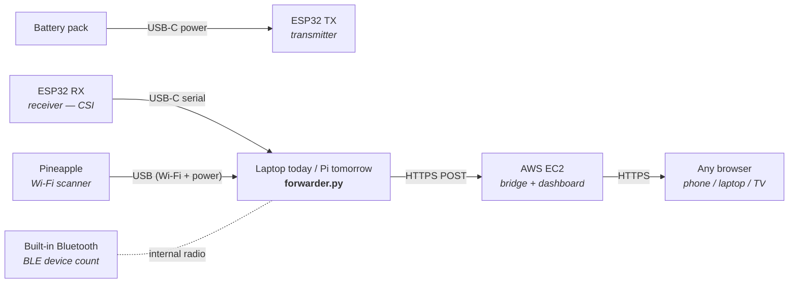

# 5map Knowledge Base

Research papers, references, and domain knowledge relevant to the 5map project.

---

## Demo Architecture

Target architecture for the initial demo. The laptop is the temporary host —
post-demo, its role moves to a Raspberry Pi (same forwarder script, same
sensors, same cloud endpoint).

### Physical room setup

Place the two ESP32s on opposite sides of the zone you want to monitor; people
moving between them disrupt the radio path and produce the CSI signal.

```mermaid
flowchart LR
    subgraph zone["Demo zone (balcony / room) — 3 to 5 m apart"]
        direction LR
        TX["ESP32 TX<br/><i>battery pack</i>"]
        Person(("Person<br/><i>disrupts signal</i>"))
        RX["ESP32 RX<br/><i>USB-C to laptop</i>"]
        PA["Wi-Fi Pineapple<br/><i>USB to laptop</i>"]
        TX -. "CSI radio waves" .- Person
        Person -. .- RX
        PA -.- TX
        PA -.- RX
    end
```

### Wiring + data flow

Three sensors plug into one host (laptop today, Pi tomorrow). The host runs
`forwarder.py`, which aggregates everything and POSTs to AWS EC2 over HTTPS.
EC2 hosts both the ingest bridge and the dashboard, so any browser on any
device can view live results.



### Notes on the four sensor sources

| Source | Role | Firmware / runtime | Replaceable by Pi? |
|---|---|---|---|
| **ESP32 TX** | Continuous Wi-Fi beacon — provides the signal whose perturbations RX measures | MicroPython is fine (no CSI read needed) | No — physical radio source |
| **ESP32 RX** | Captures Wi-Fi CSI from TX, streams over USB serial | Must be **native C / ESP-IDF** — MicroPython doesn't expose `esp_wifi_set_csi_rx_cb` | No — physical radio receiver |
| **Wi-Fi Pineapple** | Scans Wi-Fi APs / clients in range, provides RSSI map | Pineapple firmware (HAK5) | No — physical hardware |
| **Built-in Bluetooth** | Counts unique BLE devices visible to the host | Host OS Bluetooth stack (`bleak` etc. in Python) | Yes — Pi 4/5 has BLE built in |

### Laptop → Pi migration

Once the demo is proven, the host moves from a laptop to a Raspberry Pi. Same
USB ports, same `forwarder.py`, same EC2 endpoint. The Pi gains a small case,
optionally PoE-powered, and lives in the demo zone full-time.

Things that need to port cleanly when the host changes:
- USB serial enumeration (Pi assigns `/dev/ttyUSB*`, Mac assigns `/dev/cu.usbserial-*`) — `forwarder.py` should accept a port glob, not a hard path.
- `bleak` works identically on macOS and Linux for BLE scanning — no code change needed.
- Pineapple driver model differs (hostapd vs Pineapple OS over USB-Ethernet) — verify before the swap.

---

## WiPi: A Low-Cost Large-Scale Remotely-Accessible Network Testbed

**Authors:** Abdelhamid Attaby, Nada Osman, Mustafa ElNainay, Moustafa Youssef
**Published:** IEEE Access, Volume 7, November 19, 2019
**DOI:** 10.1109/ACCESS.2019.2953356

### Sources
- [IEEE Xplore](https://ieeexplore.ieee.org/abstract/document/8905988)
- [ResearchGate](https://www.researchgate.net/publication/337376522_Wipi_A_Low-Cost_Large-Scale_Remotely-Accessible_Network_Testbed)
- [Academia.edu](https://www.academia.edu/91979738/Wipi_A_Low_Cost_Large_Scale_Remotely_Accessible_Network_Testbed)

### Abstract
WiPi addresses the high cost of establishing network experimental labs by providing a remotely accessible testbed using low-cost devices (Raspberry Pi, commodity laptops). It supports large-scale networking experiments by combining simulation, emulation, and real device experimentation. The hybrid approach reduces total execution time by ~40% compared to single-node simulations.

### Architecture
- **Hardware:** Raspberry Pi 3 Model B ($25-35/unit) with PoE modules, laptops, USRP1/USRP2 SDR devices, GigE PoE switch, controller server
- **Software:** OMF (cOntrol and Management Framework), OML for measurement, ns-3 for simulation/emulation, Frisbee for multicast disk imaging, Debian-based OS

### Key Design Goals
1. **Low Cost** - Commodity Raspberry Pi and laptop hardware
2. **Heterogeneity** - Diverse device types and wireless technologies
3. **User Experience** - Homogeneous OS across heterogeneous devices
4. **Resource Pooling** - Shared USRP devices via dynamic VLANs
5. **Dynamic Topology** - VLAN isolation for concurrent experiments
6. **Power Efficiency** - PoE-controlled selective node activation
7. **Storage Optimization** - Multicast disk imaging
8. **Disk Protection** - Network booting prevents SD card corruption
9. **Multi-Domain** - GPIO pins enable IoT/sensor network extensions

### Three User Tiers
- **Expert:** Direct testbed access, custom ns-3 scripts
- **Non-ns-3:** Automatic script generation from topology designs
- **Novice:** Automatic topology partitioning with minimal config

### Hybrid Simulation-Emulation Approach
- Simulation for bulk of network, emulation for critical evaluation segments
- ns-3 EmuNetDevice: simulated nodes transmit on physical networks
- ns-3 TapNetDevice: physical nodes participate as simulated entities
- METIS partitioning for topology mapping (minimizes edge cuts)

### Performance Results
- **40% execution time reduction** vs single-node simulation (tested with 8,000 to 80,000 simulated nodes)
- **Disk imaging:** Frisbee multicast loads 2.43 GB Raspbian to 16 nodes in ~8 minutes
- Low-cost nodes support wide range of wireless networking throughput

### Relevance to 5map
- Validates low-cost hardware (Raspberry Pi, commodity devices) for large-scale wireless testbeds
- Hybrid simulation/real-device approach applicable to 5G signal mapping
- PoE-powered distributed nodes align with 5map's edge node architecture
- VLAN isolation patterns useful for multi-session capture environments
- Demonstrates feasibility of remotely-accessible wireless sensing infrastructure
