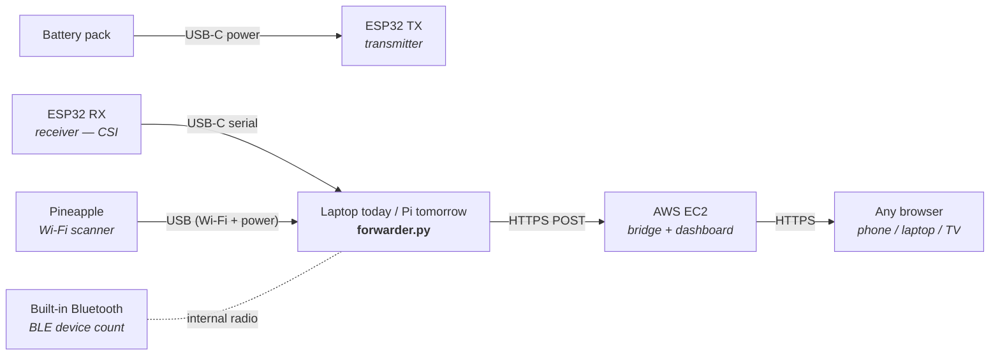

# 5map - WiFi Environment Mapper & Security Audit Tool

WiFi-based environment mapping, device tracking, and presence detection for security audits. Uses a WiFi Pineapple Mark VII and ESP32 array to capture RF data from the surrounding environment, processes it through ML models on AWS, and visualizes results in real-time dashboards and a React Native mobile app.

---

## Table of Contents

- [Architecture](#architecture)
  - [Demo Setup (initial)](#demo-setup-initial)
- [Component Roles](#component-roles)
- [Capabilities](#capabilities)
- [Hardware](#hardware)
- [Project Structure](#project-structure)
- [Quick Start](#quick-start)
- [Dashboards](#dashboards)
- [Mobile App](#mobile-app)
- [API Reference](#api-reference)
- [ML Models](#ml-models)
- [ESP32 Firmware](#esp32-firmware)
- [Signal Processing Library](#signal-processing-library)
- [AWS Infrastructure](#aws-infrastructure)
- [Terraform Modules](#terraform-modules)
- [Field Deployment Workflow](#field-deployment-workflow)
- [Data Pipeline](#data-pipeline)
- [Sensor Architecture](#sensor-architecture)
- [Security](#security)
- [Credentials](#credentials)
- [Configuration](#configuration)
- [Testing](#testing)
- [Scripts](#scripts)
- [Design Decisions](#design-decisions)
- [Roadmap](#roadmap)

---

## Architecture

```
                          FIELD DEPLOYMENT
 ┌────────────────────────────────────────────────────────────────────┐
 │                                                                    │
 │  WiFi Pineapple Mark VII        ESP32 Array (3-4 modules)         │
 │  ┌─────────────────────┐        ┌─────────────────────┐          │
 │  │ Radio 1 (5GHz)  MON │        │ BLE Scanner         │          │
 │  │ Radio 2 (2.4G)  MON │        │ CSI Capture (64 sc) │          │
 │  │ raw_capture.py      │        │ WiFi RSSI Scanner   │          │
 │  │ channel_hopper.py   │        └─────────┬───────────┘          │
 │  └────────┬────────────┘                  │ USB Serial            │
 │           │ MQTT/TLS                      │                       │
 │           │                    ┌──────────▼──────────┐            │
 │  300m Mini Router (CH340)      │   Raspberry Pi      │            │
 │  ┌─────────────────────┐       │   esp32_bridge.py   │            │
 │  │ CSI beacon source   │       │   router_bridge.py  │            │
 │  │ WiFi env sensor     │       │   Local ML inference│            │
 │  └────────┬────────────┘       │   Dashboard server  │            │
 │           │ USB Serial         │                     │            │
 │           └────────────────────┤                     │            │
 │           ┌────────────────────┤                     │            │
 │           │ MQTT/TLS           └──────────┬──────────┘            │
 │                                           │ WiFi/LTE              │
 │  React Native App                         │                       │
 │  ┌──────────────┐                         │                       │
 │  │ Signal Map   │ REST + WebSocket        │                       │
 │  │ Device List  ├─────────────────────────┘                       │
 │  │ Presence     │                                                 │
 │  │ Settings     │                                                 │
 │  └──────────────┘                                                 │
 └───────────────────────────────────┬────────────────────────────────┘
                                     │
 ┌───────────────────────────────────▼────────────────────────────────┐
 │                         AWS (eu-west-2)                            │
 │                                                                    │
 │  IoT Core ──► Kinesis (1 shard, 24h) ──► Lambda (preprocessor)   │
 │                                              │         │          │
 │                                              ▼         ▼          │
 │                                          DynamoDB   S3 Archive    │
 │                                          (5 tables)               │
 │  SageMaker ◄── Lambda ◄── DynamoDB                               │
 │  (Sparse GP, RF, LSTM)                                            │
 │                                              │                    │
 │                                              ▼                    │
 │                                    API Gateway (REST + WS)        │
 │                                    api.voicechatbox.com           │
 │                                    ws.voicechatbox.com            │
 └────────────────────────────────────────────────────────────────────┘
```

### Data Flow

```
Pineapple (WiFi frames) ──► MQTT/TLS ──► IoT Core ──► Kinesis ──► Lambda
ESP32 (BLE + CSI)       ──► Serial   ──► Pi Bridge ──► MQTT ────┘
Mini Router (beacons + WiFi env) ──► CH340 Serial ──► router_bridge.py ─┘
                                                                  │
Lambda (preprocessor) ──► DynamoDB (raw storage)                  │
                     ──► S3 (archive)                             │
                     ──► SageMaker (ML inference) ──► DynamoDB    │
                                                                  │
API Gateway (REST)  ◄── Lambda (api_handler)  ◄── DynamoDB        │
API Gateway (WSS)   ◄── Lambda (ws_handler)   ◄── DynamoDB        │
                                                                  │
Dashboard (HTML)    ◄── WebSocket + data.json fallback            │
Mobile App (RN)     ◄── REST + WebSocket                          │
```

### Demo Setup (initial)

The first proving demo is a stripped-down subset of the production
architecture above — one ESP32 TX, one ESP32 RX, one Pineapple, and a
laptop. Everything POSTs to a single AWS EC2 instance hosting both the
ingest bridge and the dashboard. **The laptop is temporary; once the demo
is proven, its role moves to a Raspberry Pi** with no other code changes.

#### Physical room setup

```mermaid
flowchart LR
    subgraph zone["Demo zone (balcony / room) — 3 to 5 m apart"]
        direction LR
        TX["ESP32 TX<br/><i>battery pack</i>"]
        Person(("Person<br/><i>disrupts signal</i>"))
        RX["ESP32 RX<br/><i>USB-C to laptop</i>"]
        PA["Wi-Fi Pineapple<br/><i>USB to laptop</i>"]
        TX -. "CSI radio waves" .- Person
        Person -. .- RX
        PA -.- TX
        PA -.- RX
    end
```

#### Wiring + data flow



#### Sensor sources for the demo

| Source | Role | Runtime | Notes |
|---|---|---|---|
| ESP32 TX | Continuous Wi-Fi beacon — provides the signal whose perturbations RX measures | MicroPython OK (no CSI read needed) | Battery powered, label "TX" |
| ESP32 RX | Captures Wi-Fi CSI from TX, streams over USB serial | **Native C / ESP-IDF required** — MicroPython doesn't expose `esp_wifi_set_csi_rx_cb` | USB-C to host, label "RX" |
| Wi-Fi Pineapple | Scans Wi-Fi APs / clients in range, RSSI map | Pineapple OS (HAK5) | USB to host |
| Built-in Bluetooth | Counts unique BLE devices visible to the host | Host OS BT stack via `bleak` (Python) | No extra hardware |

See [KNOWLEDGE.md](./KNOWLEDGE.md#demo-architecture) for the laptop → Pi
migration notes (port globbing, BLE library compatibility, Pineapple driver
differences).

---

## Component Roles

### WiFi Pineapple Mark VII — The Sensor
The Pineapple captures raw WiFi frames in monitor mode across dual radios (2.4GHz + 5GHz), extracting RSSI, MAC addresses, SSIDs, and frame types from every WiFi device in range. It detects MAC randomization, hops across channels, and streams observation windows to AWS via MQTT. Portable and battery-powered — captures and forwards with no ML processing (128MB RAM, MIPS CPU).

### 300m Mini Router — The CSI Beacon Source + WiFi Sensor
The mini router serves a dual purpose: its WiFi beacons are the signal source that ESP32 modules capture CSI from (body movement between router and ESP32 perturbs the signal across 64 subcarriers), and it independently reports WiFi environment data (connected stations, RSSI, channel utilization, noise floor) via CH340 USB-serial. Replaces the need for a dedicated ESP32 TX module. Connects via `router_bridge.py` which auto-detects the operating mode (JSON/shell/passive) and feeds observations into the sensor pipeline.

### ESP32 Array — The CSI + BLE Receivers
3-4 ESP32-WROOM-32 modules (~$5 each) positioned around the space capture:
- **WiFi CSI**: Per-subcarrier amplitude and phase data (64 subcarriers per device at 20MHz)
- **BLE scanning**: Bluetooth Low Energy + Classic device advertisements, names, TX power, service UUIDs
- **WiFi RSSI**: Parallel RSSI scanning for cross-reference with Pineapple data

ESP32 firmware available in two variants:
- `esp32/main.py` — MicroPython (quick deployment, ~2s scan interval)
- `esp32/main/main.c` — ESP-IDF C (production, higher performance, concurrent BLE + CSI)

### Raspberry Pi — The Edge Brain
The Pi receives data from the ESP32 array via USB serial (`esp32_bridge.py`), runs local ML inference for low-latency decisions (<100ms vs ~500ms to AWS), relays results to the cloud, and provides internet connectivity to the Pineapple in the field. Hosts ESP-IDF for flashing ESP32 firmware and can run the dashboard server for offline audits. Self-contained field kit — no laptop needed.

### AWS Cloud — The Backend
Heavy ML processing, persistent storage, API serving, and multi-client access. IoT Core ingests MQTT, Kinesis buffers the stream, Lambda preprocesses and routes data, SageMaker runs ML inference, DynamoDB stores results, and API Gateway serves the mobile app and dashboards.

---

## Capabilities

### Environment Mapping (Walk-and-Tag)

Walk through a space with the Pineapple/ESP32 running, tag positions in the mobile app, and 5map builds a signal strength heatmap with inferred wall positions.

**Workflow:**
1. Start a session in the mobile app, enter room dimensions (width x height in metres)
2. Walk to a spot in the space
3. Tap the position on the room grid in the app — app snapshots current RSSI readings from all visible devices
4. Repeat for as many positions as needed (minimum 3)
5. Heatmap builds up live as you tag

**Data Flow:**
```
Tap grid position → app captures (x, y) in room coordinates
                  → app fetches GET /api/devices/{session_id} for live RSSI snapshot
                  → app POSTs /api/positions with { session_id, x, y, label, rssi_snapshot[] }
                  → app runs local IDW interpolation → instant heatmap preview (< 100ms)
                  → Lambda triggered by DynamoDB stream on positions table
                  → Lambda runs EnvironmentMapper.fit() + predict_heatmap()
                  → writes heatmap + walls to environment-maps table
                  → WebSocket pushes map_update to connected clients
                  → app receives GP heatmap + walls → replaces IDW preview (2-5s)
```

**Dual rendering:** instant IDW preview on the phone for responsiveness, server-side Sparse GP model (with Nystroem approximation) for accurate interpolation and wall detection. Walls are detected by gradient magnitude thresholding — regions where signal drops sharply indicate physical obstacles.

### Device Discovery
Identifies every WiFi and Bluetooth device in range: phones, laptops, IoT devices, access points, BLE beacons. Classifies device types using a Random Forest model trained on probe patterns, RSSI variance, and OUI vendor data. Flags rogue APs and suspicious devices with risk scores.

### Presence Detection
Monitors zones for entry/exit events, movement patterns, and occupancy using a PyTorch LSTM that analyzes RSSI time-series fluctuations over 5-second sliding windows.

### MAC Randomization Detection
Identifies devices using randomized MAC addresses (modern iOS/Android behavior) by checking the locally administered bit and fingerprinting probe request patterns.

### Bluetooth Proximity Tracking
Classifies BLE devices into proximity rings (Immediate <1m, Near 1-3m, Far 3-10m, Remote >10m) based on RSSI and TX power. Resolves manufacturer from BLE company IDs (Apple, Samsung, Google, etc.). Service UUIDs are resolved to friendly names (e.g. Heart Rate, Battery Service, Google Eddystone). Devices not seen for 60+ seconds are flagged as "Gone" with dimmed display.

### Signal Intelligence Visualization
Real-time visual indicators including device radar, signal strength gauges, channel utilization charts, BLE proximity rings, risk distribution, and ESP32 CSI waveform display.

---

## Hardware

### WiFi Pineapple Mark VII
| Spec | Value |
|------|-------|
| Chipsets | MT7612EN (5GHz) + MT7628 (2.4GHz) |
| Firmware | 2.1.3 |
| Connection | USB-C to laptop (172.16.42.1) |
| Radios | wlan0 (5GHz monitor — 25 channels incl. DFS), wlan1 (2.4GHz monitor — ch 1,6,11) |
| Memory | 128MB RAM, MIPS CPU |
| Power | USB or battery pack |

### 300m Mini Router (CSI Transmitter + WiFi Sensor)
| Spec | Value |
|------|-------|
| Chipset | MT7628 (CH340 USB-serial) |
| Role | Dual-purpose: CSI beacon source + independent WiFi environment sensor |
| Connection | USB serial (CH340) to host at 115200 baud |
| Firmware | OpenWrt or stock (auto-detected) |
| Bridge | `router_bridge.py` — polls via serial, feeds pipeline |
| Sensor | `src/sensors/router_csi_sensor.py` — JSON, shell, or passive mode |

**How it fits:** The mini router replaces a dedicated ESP32 TX module. Its WiFi beacons are the signal that the ESP32 RX captures CSI from — when a person walks between the router and the ESP32, the body disrupts the signal across 64 subcarriers, enabling presence and gesture detection. Simultaneously, the router reports its own view of the WiFi environment (connected stations, RSSI, channel utilization, noise floor) as an additional sensor in the pipeline.

### ESP32 Array
| Spec | Value |
|------|-------|
| Module | ESP32-WROOM-32 |
| Count | 3-4 per deployment |
| Cost | ~$5 per module |
| CSI | 64 subcarriers at 20MHz bandwidth |
| BLE | BLE 4.2 + Classic scanning |
| Connection | USB serial to Raspberry Pi |
| Firmware | MicroPython or ESP-IDF C |

### Raspberry Pi (Edge Node)
| Spec | Value |
|------|-------|
| Role | ESP32 bridge, local ML inference, internet gateway |
| Setup | `pi-edge/firstboot.sh` (auto-configures 5map + ESP-IDF + CSI tools) |
| ESP32 Hotplug | udev rule auto-starts `5map-esp32.service` when ESP32 is plugged in (`/dev/esp32` symlink) |
| Connectivity | WiFi/LTE hotspot for Pineapple |

---

## Project Structure

```
5map/
├── pineapple/                     # WiFi Pineapple capture agent
│   ├── capture_agent.py           # Main daemon — orchestrates capture + MQTT
│   ├── channel_hopper.py          # Background channel cycling for both radios
│   ├── config.yaml                # Channels, MQTT broker, scan intervals
│   ├── setup_monitor.sh           # Configure radios for monitor mode
│   ├── init.d/5map-agent          # OpenWrt procd service script
│   ├── parsers/
│   │   ├── rssi_parser.py         # Scapy-based frame parsing (full Python)
│   │   └── raw_capture.py         # Raw socket parser (stripped OpenWrt Python)
│   └── transport/
│       └── mqtt_client.py         # AWS IoT Core MQTT with TLS + cert auth
│
├── esp32/                         # ESP32 firmware
│   ├── main.py                    # MicroPython WiFi scanner (quick deploy)
│   ├── boot.py                    # MicroPython boot configuration
│   ├── main/
│   │   ├── main.c                 # ESP-IDF BLE + CSI scanner (production)
│   │   └── CMakeLists.txt         # ESP-IDF component build
│   ├── CMakeLists.txt             # ESP-IDF project build
│   └── sdkconfig.defaults         # ESP-IDF default configuration
│
├── esp32_bridge.py                # Pi-side: reads ESP32 serial, feeds pipeline
├── router_bridge.py               # Pi-side: reads 300m mini router via CH340, feeds pipeline
│
├── src/                           # Data abstraction layer
│   ├── sensors/
│   │   ├── base.py                # SensorBase ABC + SensorFrame dataclass
│   │   ├── registry.py            # Pluggable sensor registration
│   │   ├── rssi_sensor.py         # Pineapple RSSI adapter
│   │   ├── ble_sensor.py          # ESP32 BLE adapter + manufacturer DB
│   │   ├── csi_sensor.py          # ESP32 CSI adapter (64 subcarriers)
│   │   └── router_csi_sensor.py   # 300m mini router adapter (CH340 serial)
│   ├── pipeline/
│   │   ├── frame_router.py        # Normalize sensor data for ML consumption
│   │   ├── fingerprint_collector.py # Multi-sensor RSSI correlation for positioning
│   │   ├── buffer.py              # Time-window buffering with backpressure
│   │   └── transport.py           # Abstract transport (MQTT/Kinesis)
│   └── config/
│       └── schema.py              # Pydantic config validation
│
├── backend/                       # AWS Lambda functions
│   └── handlers/
│       ├── preprocessor.py        # Kinesis-triggered: validate, enrich, archive
│       ├── api_handler.py         # REST API: map, devices, presence, sessions
│       ├── ws_handler.py          # WebSocket: connect, disconnect, subscribe
│       └── authorizer.py          # Token-based WebSocket auth
│
├── ml/                            # Machine learning models
│   ├── models/
│   │   ├── env_mapper.py          # Sparse GP environment mapping + wall detection
│   │   ├── device_fp.py           # Random Forest device fingerprinting
│   │   ├── presence_lstm.py       # PyTorch LSTM presence detection
│   │   ├── zone_classifier.py     # Random Forest zone positioning (9 zones, 15-dim features)
│   │   └── movement_tracker.py    # Device tracking with zone transition detection
│   ├── data/
│   │   ├── oui_database.py        # 82-entry IEEE OUI vendor lookup
│   │   ├── fingerprint_db.py      # RSSI fingerprint storage + BiCN statistical features
│   │   └── synthetic.py           # Synthetic data generators for training
│   ├── training/
│   │   └── train_all.py           # Train all 3 models + upload to S3
│   └── serving/
│       ├── sagemaker_handler.py   # Multi-model SageMaker endpoint
│       └── model_registry.py      # Versioned S3 model artifact management
│
├── models/trained/                # Trained model artifacts
│   ├── env_mapper.pkl             # Sparse GP model (pickle)
│   ├── presence_lstm.pt           # LSTM model (PyTorch)
│   └── device_fp/
│       ├── rf_model.joblib        # Random Forest model (joblib)
│       ├── label_encoder.joblib   # Label encoder for device types
│       └── metadata.json          # Feature names, device types, vendor list
│
├── terraform/                     # AWS infrastructure (46+ resources)
│   ├── main.tf                    # Module composition
│   ├── backend.tf                 # S3 state backend
│   ├── variables.tf               # Configurable parameters
│   └── modules/
│       ├── iot/                   # IoT Core thing, cert, policy, Kinesis rule
│       ├── kinesis/               # Data stream (1 shard, 24h retention)
│       ├── dynamodb/              # 5 tables (maps, devices, presence, sessions, connections)
│       ├── lambda/                # 4 functions + DLQ + S3 data bucket
│       ├── api/                   # API Gateway REST + WebSocket
│       ├── sagemaker/             # Model bucket + IAM role
│       ├── networking/            # VPC placeholder (SageMaker uses public endpoints)
│       └── monitoring/            # CloudWatch alarms + SNS + billing alert
│
├── app/                           # React Native mobile app (Expo)
│   ├── App.tsx                    # Tab navigation + WebSocket setup
│   ├── app.json                   # Expo configuration
│   ├── package.json               # Dependencies
│   ├── tsconfig.json              # TypeScript configuration
│   └── src/
│       ├── screens/               # Map, Devices, Presence, Settings
│       ├── components/            # HeatmapOverlay, DeviceCard, PresenceTimeline, PositionMarker
│       ├── services/              # REST API client, WebSocket client, AsyncStorage
│       ├── hooks/                 # useMap, useDevices, usePresence
│       ├── store/                 # Zustand global state (map, devices, presence, session, ws)
│       └── types/                 # TypeScript interfaces
│
├── dashboard/                     # Web dashboards
│   ├── index.html                 # Main 4-panel audit dashboard
│   ├── visual-indicators.html     # 6-panel signal intelligence dashboard
│   ├── signal-processing.js       # Signal analysis algorithm library + classifyDevice
│   ├── environment.html           # Full-page 3D environment with toggleable data layers
│   ├── detail-csi-mapping.html    # CSI environment mapping with walk-and-tag fingerprinting
│   ├── data.json                  # Live capture data (auto-updated by bridges)
│   ├── wifi_data.json             # ESP32 WiFi scan data (bridge output)
│   ├── ble_data.json              # BLE scan data (scanner output)
│   └── server.py                  # Local Python proxy server
│
├── pi-edge/                       # Raspberry Pi edge node
│   └── firstboot.sh               # First-boot: 5map + ESP-IDF + CSI tools
│
├── scripts/                       # Deployment and setup
│   ├── start_sensors.sh           # Auto-discover and start all sensors + bridges
│   ├── merge_data.py              # Merge wifi/ble data files into data.json
│   ├── deploy.sh                  # Terraform deploy with S3 state bootstrap
│   ├── teardown.sh                # Terraform destroy with confirmation
│   ├── setup_pineapple.sh         # Configure Pineapple via SSH
│   ├── deploy_sagemaker.sh        # Upload trained models to SageMaker via S3
│   └── generate_test_data.py      # Create synthetic test fixtures
│
├── tests/                         # Test suite (117+ tests)
│   ├── test_rssi_parser.py        # RSSI extraction, MAC detection, channels
│   ├── test_channel_hopper.py     # Channel cycling, frequency conversion
│   ├── test_mqtt_client.py        # MQTT transport, queue, reconnect
│   ├── test_sensor_base.py        # ABC contract, SensorFrame serialization
│   ├── test_registry.py           # Plugin registration, thread safety
│   ├── test_frame_router.py       # RSSI/CSI normalization
│   ├── test_buffer.py             # Backpressure, concurrent writes
│   ├── test_config_schema.py      # Pydantic validation
│   ├── test_lambda/               # Lambda preprocessor + API handler
│   ├── test_ml/                   # GP mapper, RF fingerprinter, LSTM detector
│   └── integration/               # End-to-end pipeline tests
│
└── pyproject.toml                 # Python project config (fivemap)
```

---

## Quick Start

### Prerequisites
- WiFi Pineapple Mark VII connected via USB
- AWS CLI configured (`aws configure`) — Account 835661413889, eu-west-2
- Terraform >= 1.5
- Python >= 3.9
- Node.js >= 18

### 1. Deploy AWS Infrastructure
```bash
./scripts/deploy.sh
```
Bootstraps the S3 state backend, runs `terraform plan`, and applies after confirmation. Creates 46+ AWS resources.

### 2. Configure Pineapple
```bash
./scripts/setup_pineapple.sh 172.16.42.1
```
Copies the capture agent, IoT certificates, and Python dependencies to the Pineapple. Installs the init.d service.

### 3. Start Capture
```bash
ssh root@172.16.42.1 '/etc/init.d/5map-agent start'
```

### 4. View Dashboards
```bash
cd dashboard && python3 -m http.server 8080
```
- Main dashboard: http://localhost:8080
- Visual indicators: http://localhost:8080/visual-indicators.html

### 5. Mobile App
```bash
cd app && npm install && npx expo start
# Scan QR code with Expo Go
```

### 6. Flash ESP32 (MicroPython)
```bash
# Copy main.py and boot.py to ESP32 via mpremote/Thonny
mpremote connect /dev/ttyUSB0 cp esp32/main.py :main.py
mpremote connect /dev/ttyUSB0 cp esp32/boot.py :boot.py
mpremote connect /dev/ttyUSB0 reset
```

### 7. Flash ESP32 (ESP-IDF — production)
```bash
cd esp32
idf.py set-target esp32
idf.py build
idf.py -p /dev/ttyUSB0 flash monitor
```

### 8. Start ESP32 Bridge (on Pi)
```bash
python3 esp32_bridge.py --port /dev/ttyUSB0 --config /etc/5map/config.yaml
```

### 9. Train ML Models
```bash
pip install -e ".[ml]"
python -m ml.training.train_all
```

### 10. Deploy Models to SageMaker
```bash
./scripts/deploy_sagemaker.sh
```

### 11. Run Tests
```bash
pip install -e ".[dev,ml]"
pytest tests/ -v
```

---

## Dashboards

### Main Dashboard (`dashboard/index.html`)

The primary audit command center with real-time data from the Pineapple, ESP32, and 300m mini router.

**Layout:**
| Panel | Position | Description |
|-------|----------|-------------|
| Signal Map | Top-left (wide) | Canvas heatmap with bilinear interpolation, wall overlays, position markers. Green=strong, Yellow=medium, Red=weak |
| Stats | Top-right | Total devices, rogue count, randomized MACs, active zones, WebSocket status |
| WiFi Devices | Bottom row | Sortable table with type icons, MAC, SSID, vendor, channel, RSSI bars, risk badges |
| Bluetooth Devices | Bottom row | BLE/Classic/Beacon table with name, manufacturer, RSSI, TX power, connectable status |
| CSI & RSSI Monitor | Bottom row | Router connection status, poll/observation/window/error counts, 64-subcarrier CSI waveform canvas (orange accent) |
| Presence Timeline | Bottom row | Chronological event feed with Entry/Exit/Moving/Stationary markers, confidence scores |

**Features:**
- WebSocket real-time updates via `wss://ws.voicechatbox.com`
- 1-second polling fallback when WebSocket is disconnected
- Session management (create/join/switch sessions)
- Column sorting on all tables
- HiDPI canvas rendering
- Responsive layout (desktop + tablet)

### Visual Indicators Dashboard (`dashboard/visual-indicators.html`)

Signal intelligence page with rich animated visualizations.

**Layout:**
| Panel | Position | Description |
|-------|----------|-------------|
| Device Radar | Top-left (wide) | Polar radar with all WiFi + BLE devices positioned by estimated distance. Animated sweep line (4s rotation). Grouped by band quadrant. |
| Signal Gauges | Top-right | 270-degree arc gauges per AP. RSSI mapped to percentage with quality labels (Excellent/Good/Fair/Weak/Dead) |
| Channel Utilization | Middle-left | Stacked bar chart by channel, color-coded by device type, 2.4/5GHz separator |
| BLE Proximity Rings | Middle-right | 4 concentric sonar rings (Immediate/Near/Far/Remote) with animated ripple effects |
| Risk Overview | Bottom-left | Donut chart + high-risk device cards with pulsing red borders |
| ESP32 CSI Preview | Bottom-right | Synthetic 64-subcarrier waveform + phase gradient. Status: STANDBY |

**Features:**
- WebSocket real-time updates with instant visual rebuild on every message
- 1-second polling fallback
- 60fps animation via `requestAnimationFrame`
- Signal jitter simulation (+/-2 dBm) for live feel on static data
- Hover tooltips and click-to-highlight across panels
- Distance estimation using log-distance path loss model: `d = 10^((TxPower - RSSI) / (10 * 2.7))`

### 3D Environment Monitor (`dashboard/environment.html`)

Full-page isometric 3D room visualization for indoor positioning and movement tracking.

**Features:**
- Isometric wireframe room (5m × 5m, 1.8m walls) with auto-rotating view
- Sensor positions: Router (left, orange), ESP32 (right, cyan), Pineapple (back, red)
- WiFi devices positioned by RSSI-estimated distance with type icons (phone/laptop/AP/IoT/unknown)
- Risk color coding: green (<0.3), amber (0.3-0.6), red (>0.6)
- Signal heatmap overlay on floor when map data available
- Toggleable data layers: Grid, Walls, Heatmap, Devices, Labels, Risk Halos
- Click device for detail panel (MAC, SSID, RSSI, channel, vendor)
- Loads `signal-processing.js` for `classifyDevice()` heuristic

### CSI Environment Mapping (`dashboard/detail-csi-mapping.html`)

Interactive CSI-based physical environment mapping page for walk-and-tag fingerprint collection, real-time subcarrier visualization, and motion detection.

**Layout:**
| Panel | Position | Description |
|-------|----------|-------------|
| Floor Plan | Left (wide) | Interactive grid canvas with pan/zoom, click-to-tag calibration points, zone definition via right-click, IDW heatmap overlay |
| Subcarrier Waterfall | Right (top) | 60-row scrolling spectrogram of 64 subcarrier amplitudes, viridis colour ramp (purple→blue→cyan→green→yellow) |
| Phase Response | Right (bottom) | Linear phase plot (-π to +π) across subcarriers with gridlines |
| Motion Gauge | Bottom-left | Semi-circular arc gauge (0-100%), green→amber→red gradient |
| Breathing Indicator | Bottom | Pulsing circle with BPM readout when periodic motion detected |
| Stats & Controls | Bottom | Mode toggle, session management, grid scale, export JSON |

**Three Modes:**
- **Calibrate** — Click canvas to place numbered position markers; CSI amplitude/phase snapshot captured per position
- **Monitor** — Real-time CSI visualization with motion detection, no position tagging
- **Heatmap** — IDW-interpolated fingerprint map overlay from tagged positions

**Features:**
- Mock CSI data generator with Gaussian-envelope amplitude baseline, motion random walk, and breathing oscillation (~16 BPM)
- Viridis waterfall spectrogram showing subcarrier amplitude changes over time
- Zone definition via right-click rubber-band rectangles with custom labels
- Position chips with click-to-delete in panel header
- Export positions/zones as JSON
- API integration with `/api/sessions` and `/api/positions` (graceful fallback to mock data)
- 60fps rendering via `requestAnimationFrame`
- HiDPI canvas rendering
- Responsive layout (collapses to single column on <1100px)

**Navigation:** All dashboard pages linked in header nav bar.

### Reading the Dashboards

**Signal Map Colors:**
- Green = strong (-30 to -50 dBm) — close to AP
- Yellow = medium (-50 to -70 dBm) — moderate distance
- Red = weak (-70 to -90 dBm) — far or behind walls
- Dashed lines = inferred walls (sharp signal drop-offs)

**Risk Badges:**
- `LOW` (green) = known vendor, normal behavior (score < 0.3)
- `MED` (yellow) = suspicious patterns (score 0.3-0.6)
- `HIGH` (red) = potential rogue AP or attacker (score > 0.6)

**BLE Proximity Rings:**
- Immediate (green, <1m): RSSI > -50 dBm
- Near (cyan, 1-3m): RSSI -50 to -70 dBm
- Far (amber, 3-10m): RSSI -70 to -85 dBm
- Remote (red, >10m): RSSI < -85 dBm

**Status Indicators:**
- Green pulsing dot = WebSocket connected, streaming live
- Red dot = disconnected, polling fallback active

---

## Mobile App

React Native (Expo) app for field use during 5G/Bluetooth CSI/RSSI mapping audits.

**Why a mobile app?** You walk around a physical space with your phone running this app, tagging positions while ESP32 sensors and the WiFi Pineapple feed signal data. The app connects via WebSocket to the backend for real-time CSI/RSSI data, then renders heatmaps and device positions as you move. A mobile form factor is essential for this walk-and-map workflow. The web view (`npx expo start` then press `w`) is available for desktop development and monitoring.

**Screens:**
| Screen | Purpose |
|--------|---------|
| Map | Signal heatmap visualization — tag physical positions, see RSSI/CSI coverage build in real-time |
| Devices | List all detected BLE/WiFi devices with risk indicators and signal strength |
| Presence | Track device presence and movement events over time per zone |
| Settings | Configure backend connection, manage audit sessions, view connection status |

**Tech Stack:**
- React Native + Expo (cross-platform: iOS, Android, Web)
- TypeScript
- Zustand (state management)
- WebSocket + REST API client
- AsyncStorage (offline persistence)

**State Management (Zustand):**
- `MapSlice` — heatmap data, tagged positions
- `DevicesSlice` — discovered devices, real-time updates
- `PresenceSlice` — presence events (capped at 500)
- `SessionSlice` — current/available sessions
- `ConnectionSlice` — WebSocket connection status

```bash
cd app && npm install && npx expo start
```

---

## API Reference

### REST Endpoints

| Method | Path | Description |
|--------|------|-------------|
| `POST` | `/api/sessions` | Create new audit session |
| `GET` | `/api/map/{session_id}` | Get environment map data |
| `GET` | `/api/devices/{session_id}` | List discovered devices |
| `GET` | `/api/presence/{session_id}` | Get presence events |
| `POST` | `/api/positions` | Tag a physical position |

### WebSocket Messages

| Direction | Type | Payload |
|-----------|------|---------|
| Client → Server | `subscribe` | `{ session_id }` |
| Client → Server | `unsubscribe` | `{ session_id }` |
| Client → Server | `ping` | `{}` |
| Server → Client | `map_update` | `{ heatmap, walls, grid_bounds, confidence }` |
| Server → Client | `device_update` | `{ mac_address, device_type, rssi_dbm, risk_score, ... }` |
| Server → Client | `presence_event` | `{ event_type, zone, confidence, device_count }` |
| Server → Client | `bluetooth_update` | `{ mac_address, device_name, rssi_dbm, tx_power, ... }` |

### Live Endpoints

| Service | URL |
|---------|-----|
| REST API | `https://api.voicechatbox.com` |
| WebSocket | `wss://ws.voicechatbox.com` |
| IoT Core | `a2qz7dpyqsh35h-ats.iot.eu-west-2.amazonaws.com` |
| Dashboard | `https://5map.voicechatbox.com` |
| Auth Token | `mvp-token` (Cognito planned) |

---

## ML Models

### Environment Mapper (Sparse Gaussian Process)
| Property | Value |
|----------|-------|
| Input | RSSI observations tagged with x,y positions |
| Output | 2D signal heatmap + inferred wall positions |
| Algorithm | Sparse GP with Nystroem approximation — O(1) inference |
| Wall detection | Gradient magnitude thresholding on heatmap |
| Artifact | `models/trained/env_mapper.pkl` |

### Device Fingerprinter (Random Forest)
| Property | Value |
|----------|-------|
| Input | 10 features per device + 21 OUI one-hot columns = 31-dim vector |
| Output | Device type (phone/laptop/IoT/AP/unknown) + risk score |
| Features | is_randomized_mac, probe_frequency, rssi_variance, num_unique_channels, beacon_pct, probe_pct, data_pct, mgmt_pct, supported_rates_count, ssid_probe_count |
| Risk scoring | Rogue AP (0.8), unknown+randomized (0.6), unknown vendor (0.5), known normal (0.1) |
| OUI database | 82 entries (Apple, Samsung, Google, Intel, Broadcom, Cisco, TP-Link, Espressif, ...) |
| Artifact | `models/trained/device_fp/rf_model.joblib` |

### Presence Detector (PyTorch LSTM)
| Property | Value |
|----------|-------|
| Input | 5-second sliding window of RSSI statistics (mean, variance, device count, new device count) |
| Output | Presence event classification (empty/stationary/moving/entry/exit) with confidence |
| Architecture | 2 layers, 64 hidden units, dropout 0.2 (~50K parameters) |
| Artifact | `models/trained/presence_lstm.pt` |

### Training
```bash
pip install -e ".[ml]"
python -m ml.training.train_all
# Outputs to models/trained/
```

### SageMaker Deployment
```bash
./scripts/deploy_sagemaker.sh [version]
# Packages artifacts → uploads to S3 → creates SageMaker model
```

---

## Indoor Positioning & Movement Tracking

Zone-based indoor positioning using multi-sensor RSSI fingerprinting. Based on the BiCN dual-band WiFi signal fusion approach (Own et al., IEEE Access — 0.99m accuracy with 3 APs).

### Architecture

```
3 WiFi Sensors (known positions)     Device walks through space
┌──────────────┐                     ┌─────────────┐
│ Router (0.5,2.5)  ──── RSSI ────→ │             │
│ ESP32  (4.5,2.5)  ──── RSSI ────→ │ Fingerprint │ → Zone Classifier → Movement Tracker
│ Pineapple (2.5,4.5) ── RSSI ────→ │ Collector   │   (Random Forest)   (Zone transitions)
└──────────────┘                     └─────────────┘
```

### Zone Grid
Room divided into 3×3 = 9 zones. Each device produces a 15-dimensional feature vector:
- 3 raw RSSI values (one per sensor)
- 12 statistical features (mean, std, skewness, kurtosis per sensor — BiCN method)

### Zone Classifier (`ml/models/zone_classifier.py`)
| Property | Value |
|----------|-------|
| Algorithm | Random Forest (100 estimators) |
| Input | 15-dim feature vector per device |
| Output | Zone ID (zone_0_0 to zone_2_2) + confidence score |
| Training | Synthetic data via log-distance path loss model |
| Accuracy | ~67-79% on synthetic data (improves with real calibration) |

### Movement Tracker (`ml/models/movement_tracker.py`)
| Property | Value |
|----------|-------|
| Input | Zone predictions per device over time |
| Output | Device tracks with zone transition history |
| Confirmation | Zone change requires 2+ consecutive observations |
| Timeout | Device marked inactive after 60s without observation |
| Track format | Time-ordered zone visits with enter/leave timestamps |

### Fingerprint Collector (`src/pipeline/fingerprint_collector.py`)
Correlates the same MAC address observed across multiple sensors within a 2-second window. Computes BiCN statistical features from a rolling history of 20 RSSI readings per sensor per device.

### Research Basis
- **BiCN Paper**: Dual-band fusion, SVM NLOS detection (>96%), Capsule Networks (0.99m accuracy)
- **EP3695783A1**: Wireless gait recognition via CSI time-series, Dynamic Time Warping
- **CSI vs RSSI**: CSI gives 0.5-1.2m positioning (3-5x better than RSSI's 2-5m)
- See [KNOWLEDGE.md](./KNOWLEDGE.md) for detailed research notes

---

## ESP32 Firmware

### MicroPython Variant (`esp32/main.py`)
- Scans WiFi networks every 2 seconds
- Outputs JSON lines over serial: `{"type":"scan","networks":[...]}`
- Detects randomized MACs
- Status reports every 30 seconds with heap usage
- Channel hopping with 100ms dwell time

### ESP-IDF C Variant (`esp32/main/main.c`)
- Concurrent BLE + CSI scanning using FreeRTOS tasks
- BLE output: `{"t":"ble","mac":"...","name":"...","rssi":-62,"tx":-12,"svc":["FE2C"],"mfr":"4C00","conn":1}`
- CSI output: `{"t":"csi","mac":"...","rssi":-55,"ch":6,"bw":20,"len":128,"ts":123456}`
- Built with ESP-IDF v5.x

### ESP32 Bridge (`esp32_bridge.py`)
Runs on the Raspberry Pi — reads JSON lines from ESP32 serial, parses BLE and CSI observations, aggregates into time windows, and publishes to AWS IoT Core via MQTT. Also serves data locally for the dashboard.

```bash
python3 esp32_bridge.py --port /dev/ttyUSB0 --config /etc/5map/config.yaml
```

---

## Signal Processing Library

`dashboard/signal-processing.js` (1505 lines) — vanilla JS, zero dependencies.

| Algorithm | Function | Description |
|-----------|----------|-------------|
| Distance Estimation | `estimateDistance()` | Log-distance path loss: `d = 10^((TxPower - RSSI) / (10 * n))` |
| Polar Radar | `generateRadarData()` | Converts all devices to polar coordinates grouped by band |
| Signal Gauges | `generateGaugeData()` | RSSI to percentage/quality for arc gauge rendering |
| Channel Analysis | `analyzeChannelUtilization()` | Device count + congestion score per channel |
| BLE Proximity | `calculateBleProximityRings()` | 4-ring classification based on RSSI thresholds |
| Risk Heatmap | `generateRiskHeatmap()` | Gaussian kernel risk spread to canvas-ready RGBA |
| Signal Simulation | `createSignalSimulator()` | Gaussian jitter + EMA smoothing for live feel |
| CSI Waveform | `generateCSIWaveform()` | Synthetic 64-subcarrier OFDM with Rayleigh fading |

Canvas rendering helpers included: `drawRadarPlot`, `drawSignalGauge`, `drawChannelBars`, `drawBleProximityRings`, `drawCSIWaveform`, `drawScanSweep`, `renderRiskHeatmapToCanvas`.

---

## AWS Infrastructure

### Resources (46+ total)

| Service | Resources | Purpose |
|---------|-----------|---------|
| IoT Core | Thing, certificate, policy, topic rule | Pineapple/Pi MQTT ingestion |
| Kinesis | 1-shard data stream (24h retention) | Ordered event buffering |
| Lambda | 4 functions + DLQ | Preprocessing, REST API, WebSocket, auth |
| DynamoDB | 5 tables (on-demand billing) | Maps, devices, presence, sessions, connections |
| API Gateway | REST API + WebSocket API | Dashboard and app access |
| S3 | 2 buckets (data + models) | Raw archive + ML model artifacts |
| CloudWatch | 3 alarms + SNS topic | Lambda errors, Kinesis lag, billing ($50 threshold) |
| SageMaker | IAM role + model bucket | ML serving (endpoint on demand) |

### Terraform Modules

| Module | Resources | Purpose |
|--------|-----------|---------|
| `iot/` | Thing, X.509 cert, policy, Kinesis rule | MQTT ingestion with cert auth |
| `kinesis/` | Data stream (1 shard) | 24h ordered event buffering |
| `dynamodb/` | 5 tables | Schemaless storage for evolving sensor data |
| `lambda/` | 4 functions, DLQ, S3 bucket | Serverless compute + data archive |
| `api/` | REST + WebSocket APIs | Client-facing endpoints |
| `sagemaker/` | IAM role, model bucket | ML model serving infrastructure |
| `networking/` | VPC placeholder | SageMaker uses public endpoints for MVP |
| `monitoring/` | 3 CloudWatch alarms, SNS | Alerting and cost control |

### Estimated Cost
$15-30/month depending on usage. DynamoDB on-demand billing prevents spikes. CloudWatch billing alarm at $50/month threshold.

---

## Field Deployment Workflow

### Current Setup (Pineapple + Laptop)
```
Pineapple ──(USB)──► Laptop ──(Internet)──► AWS ──► Dashboard/App
```

1. Power on Pineapple, connect via USB (172.16.42.1)
2. Start capture: `ssh root@172.16.42.1 '/etc/init.d/5map-agent start'`
3. Open dashboard or mobile app
4. Create new audit session
5. Walk the perimeter tagging positions (minimum 10 for useful map)
6. Station Pineapple centrally for continuous monitoring
7. Monitor device list for rogue APs and suspicious devices
8. Review presence timeline for zone activity

### Future Setup (Full Kit — No Laptop)
```
ESP32 array ──(serial)──► Raspberry Pi ──(WiFi/LTE)──► AWS
                                ▲
Pineapple ──(MQTT via Pi)───────┘
                                │
                          React Native App
                          (connects to Pi or AWS)
```

---

## Data Pipeline

### Sensor Layer
All sensors implement the `SensorBase` abstract base class, producing `SensorFrame` objects with a common schema:

```python
@dataclass
class SensorObservation:
    mac: str
    rssi_dbm: int
    noise_dbm: int | None
    channel: int
    bandwidth: str
    frame_type: str
    ssid: str | None
    is_randomized_mac: bool
    count: int
```

### Registered Sensors
| Sensor | Source | Data Type |
|--------|--------|-----------|
| `RSSISensor` | Pineapple | WiFi RSSI frames |
| `BLESensor` | ESP32 | BLE advertisements, names, TX power, service UUIDs |
| `CSISensor` | ESP32 | 64-subcarrier amplitude + phase per frame |
| `RouterCSISensor` | 300m Mini Router | WiFi stations, RSSI, channel, noise floor via CH340 serial |

### Pipeline Flow
1. **Capture**: Sensor produces raw observations
2. **Buffer**: Time-window aggregation with backpressure (`buffer.py`)
3. **Route**: Frame router normalizes for ML consumption (`frame_router.py`)
4. **Transport**: MQTT to IoT Core or Kinesis (`transport.py`)
5. **Preprocess**: Lambda validates, enriches, archives to S3
6. **Infer**: SageMaker runs ML models (GP, RF, LSTM)
7. **Store**: Results written to DynamoDB
8. **Serve**: API Gateway pushes to dashboards and app

---

## Sensor Architecture

Pluggable sensor interface — add new sensor types without refactoring the pipeline.

```python
from src.sensors.base import SensorBase

class MySensor(SensorBase):
    sensor_type = SensorType.CUSTOM
    
    def start(self): ...
    def stop(self): ...
    def read_frames(self) -> list[SensorFrame]: ...
```

Register via the sensor registry:
```python
from src.sensors.registry import SensorRegistry
SensorRegistry.register("my_sensor", MySensor)
```

---

## Security

- **IoT Core**: X.509 certificate authentication (not password)
- **Certificates**: Stored with 600 permissions on Pineapple
- **API Gateway**: Token-based auth (`mvp-token`, Cognito planned)
- **Password policy**: No exclamation marks (ALB compatibility)
- **DynamoDB**: On-demand billing prevents cost spikes
- **Monitoring**: CloudWatch billing alarm at $50/month
- **Terraform state**: Encrypted in S3 with versioning
- **ESP32 bridge**: TLS on MQTT connections to IoT Core

---

## Credentials

| System | Access | Credentials |
|--------|--------|-------------|
| Pineapple SSH | `ssh root@172.16.42.1` | `hak5pineapple` |
| Pineapple Web UI | `http://172.16.42.1:1471` | `root` / `hak5pineapple` |
| AWS Account | 835661413889 (eu-west-2) | AWS CLI configured |
| API Auth | Bearer token | `mvp-token` |
| Active Session | `e8076d73-ce66-4ed8-85fb-ef715f8844cf` | Live Audit |

---

## Configuration

### Pineapple (`pineapple/config.yaml`)
- Channel lists for 2.4GHz and 5GHz
- MQTT broker endpoint and certificate paths
- Scan intervals and observation window size

### Python Project (`pyproject.toml`)
```
[project] name = "fivemap", version = "0.1.0"
Core:  scapy, paho-mqtt, pyyaml, pydantic
ML:    scikit-learn, torch, numpy, pandas, boto3
Dev:   pytest, pytest-asyncio, pytest-cov, ruff
```

### Terraform (`terraform/variables.tf`)
- AWS region, project prefix, billing thresholds
- Kinesis shard count, DynamoDB table names
- Lambda runtime configuration

---

## Testing

143+ tests covering all components.

```bash
pip install -e ".[dev,ml]"
pytest tests/ -v
```

| Test File | Coverage |
|-----------|----------|
| `test_rssi_parser.py` | RSSI extraction, MAC detection, channel mapping |
| `test_channel_hopper.py` | Channel cycling, frequency conversion |
| `test_mqtt_client.py` | MQTT transport, queue management, reconnect |
| `test_sensor_base.py` | ABC contract, SensorFrame serialization |
| `test_registry.py` | Plugin registration, thread safety |
| `test_frame_router.py` | RSSI/CSI normalization |
| `test_buffer.py` | Backpressure, concurrent writes |
| `test_config_schema.py` | Pydantic validation |
| `test_lambda/` | Lambda preprocessor + API handler |
| `test_ml/` | GP mapper, RF fingerprinter, LSTM detector, zone classifier |
| `test_fingerprint_collector.py` | Multi-sensor RSSI correlation, BiCN features |
| `integration/` | End-to-end pipeline tests |

---

## Scripts

| Script | Usage | Description |
|--------|-------|-------------|
| `start_sensors.sh` | `./scripts/start_sensors.sh` | Auto-discover all sensors, validate, start bridges + dashboard. Asks home/field mode |
| `merge_data.py` | `python scripts/merge_data.py` | Background daemon merging wifi_data.json + ble_data.json → data.json |
| `deploy.sh` | `./scripts/deploy.sh` | Bootstrap S3 state backend + terraform apply |
| `teardown.sh` | `./scripts/teardown.sh` | Terraform destroy with confirmation prompt |
| `setup_pineapple.sh` | `./scripts/setup_pineapple.sh 172.16.42.1` | Copy agent, certs, deps to Pineapple via SSH |
| `deploy_sagemaker.sh` | `./scripts/deploy_sagemaker.sh [version]` | Package and upload trained models to S3/SageMaker |
| `generate_test_data.py` | `python scripts/generate_test_data.py` | Create synthetic test fixtures |

---

## Design Decisions

### Why WiFi Pineapple?
Dual radios (MT7612EN 5GHz + MT7628 2.4GHz) in simultaneous monitor mode. Runs OpenWrt with Python. **Limitation**: Stripped Python 3.9 lacks `ctypes` (scapy dependency). Solution: raw socket capture using `AF_PACKET` + `struct`-based radiotap parsing. Zero external dependencies.

### Why RSSI + CSI (not RSSI alone)?
RSSI is a single number per frame. CSI provides 64 subcarrier amplitudes and phases — enabling gesture recognition, centimeter-level positioning, and activity detection. RSSI was the immediately viable approach; the pluggable sensor interface (`SensorBase` ABC) allows ESP32 CSI modules without pipeline refactoring.

### Why AWS Over Local?
Pineapple has 128MB RAM on MIPS — can't run ML inference. AWS provides IoT Core (MQTT), Kinesis (streaming), SageMaker (ML), DynamoDB (storage), API Gateway (serving). Cost: $15-30/month.

### Why Sparse GP for Mapping?
Standard GP is O(n^3) time / O(n^2) memory — unusable above ~100 points. Sparse GP with Nystroem approximation: O(1) inference, under 200ms regardless of dataset size.

### Why LSTM for Presence?
RSSI time-series have temporal patterns distinguishing stationary vs moving devices. 2-layer LSTM (64 hidden, ~50K params) captures these while staying lightweight for SageMaker real-time inference.

### Why React Native + Web Dashboard?
Two workflows: React Native for field use (walk site, tag positions, get alerts on phone). Web dashboard for command center (monitor sessions, analyze data, generate reports from laptop).

### Why Vanilla JS Dashboards (not React)?
The dashboards are self-contained single HTML files that load from a static `data.json` file or WebSocket. No build step, no bundler, no npm install — just `python3 -m http.server`. Works offline on the Pi.

### Why Zone Classification Over Trilateration?
With only 3 sensors in a 5m×5m room, trilateration produces unstable position estimates (poor DOP with sensor geometry). Zone classification into 9 regions is more achievable and more useful for security auditing — "device was in the server room zone" is more actionable than "device was at coordinates 2.3, 1.7". Based on BiCN paper results showing Capsule Networks outperform KNN/WKNN at zone-level positioning.

### Why RSSI Over CSI (For Now)?
CSI gives 3-5x better resolution (0.5-1.2m vs 2-5m) but requires original ESP32 or ESP32-C5/C6 — the ESP32-S2 does not support CSI. Current RSSI approach is adequate for zone-level tracking. CSI upgrade planned when compatible hardware is deployed.

---

## Roadmap

### Completed
- [x] **3D environment monitor** — Isometric room visualization with device positioning, wireframe toggle, fullscreen mode
- [x] **Zone classifier** — Random Forest zone positioning using multi-sensor RSSI fingerprints (BiCN approach)
- [x] **Movement tracker** — Zone transition detection with confirmation, device track history
- [x] **SSH router bridge** — GL-MT300N-V2 WiFi scanning over SSH (no USB cable needed)
- [x] **ESP32-S2 firmware fix** — Stable WiFi scanning with graceful CSI fallback
- [x] **BLE scanner** — Laptop Bluetooth scanning with dashboard integration
- [x] **Sensor startup script** — Auto-discover, validate, and start all sensors

- [x] **CSI environment mapping dashboard** — Walk-and-tag fingerprint collection with subcarrier waterfall, phase plot, motion gauge, breathing detection, and IDW heatmap
- [x] **Dual-band dongle support** — Realtek 8812AU config for single-dongle 2.4GHz + 5GHz channel hopping in monitor mode

### In Progress
- [ ] **Dashboard trajectory rendering** — Spline paths on 3D isometric view showing device movement history
- [ ] **Behavioral fingerprinting** — Track devices across MAC randomization using probe patterns and RSSI spatial signatures

### Planned
- [ ] **ESP32 CSI integration** — Flash original ESP32 with CSI firmware for sub-metre positioning
- [ ] **CNN-LSTM upgrade** — Add CNN front-end to LSTM for 95%+ HAR accuracy (per research findings)
- [ ] **Particle filter** — Continuous position tracking when >4 reference points available
- [ ] **Raspberry Pi edge node** — Local ML inference for <100ms latency
- [ ] **Cognito auth** — Replace MVP token auth with proper user management
- [ ] **Multi-site support** — Multiple Pineapples streaming to the same dashboard
- [ ] **Gait recognition** — Per EP3695783A1 patent, identify individuals by walking pattern via CSI
- [ ] **Multi-floor mapping** — 3D signal mapping across building floors
